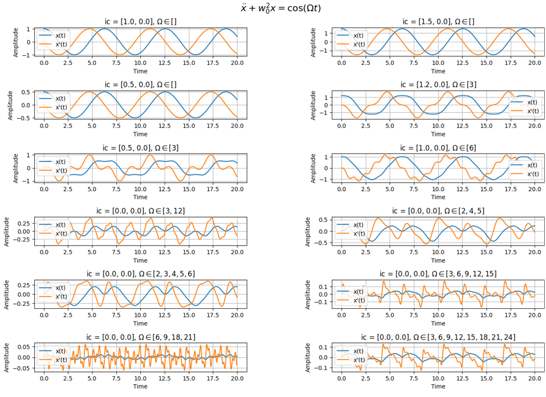
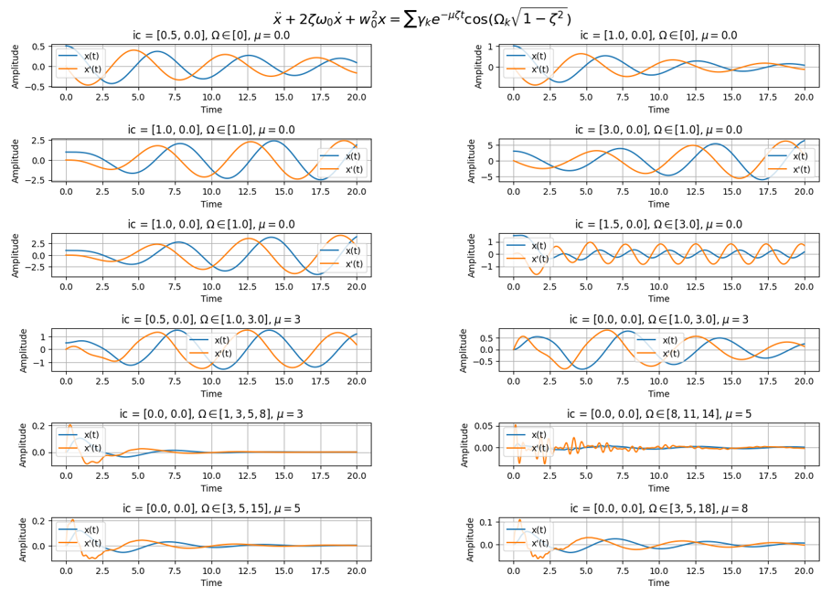
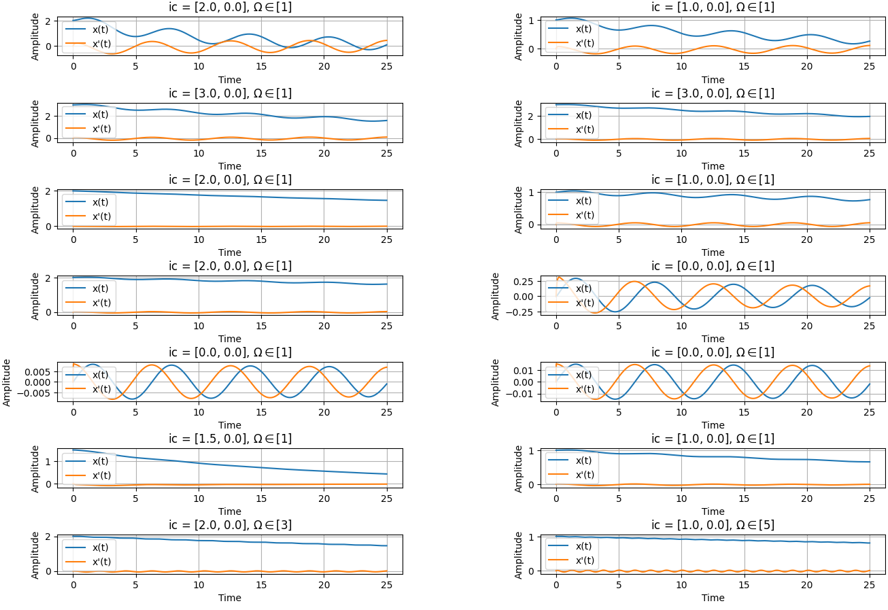
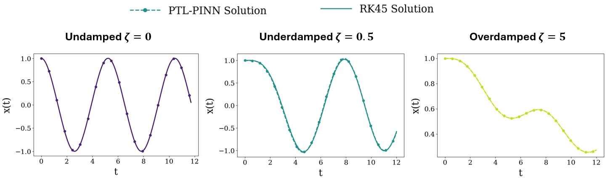
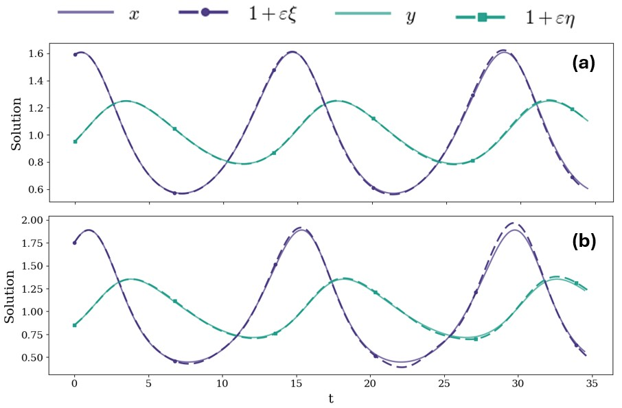

# Perturbation-Guided Transfer Learning with Physics-Informed Neural Networks for Nonlinear Systems

**Authors:** Duarte Alexandrino, Prof. Pavlos Protopapas, Dr. Ben Moseley  
**Contact:** d.alexandrino2010@gmail.com

> Submission to Journal of Computational Physics

---

## 🔎 Overview

Accurately and efficiently solving nonlinear differential equations is crucial for modelling dynamic behavior across science and engineering. Physics-Informed Neural Networks (PINNs) have emerged as a powerful solution. However, these struggle to model nonlinear dynamics, suffering from limited generalization across problems and long training times. To address these limitations, we propose a perturbation-guided transfer learning framework for PINNs (PTL-PINN), which integrates perturbation theory with transfer learning to solve nonlinear oscillators efficiently.

This repository contains the code used to develop the **PTL-PINN** — a **Perturbation-Guided Transfer Learning** framework for **Physics-Informed Neural Networks (PINNs)**. By training foundational PINN models on equations representative of the perturbation system and using one-shot transfer learning, PTL-PINN can compute solutions with the time complexity of matrix-vector multiplication.

---

## Key Contributions

- **Novel Lindstedt-Poincare implementation**: new numerical and scalable implementation of the Lindstedt-Poincare for undamped nonlinear oscillators with polynomial nonlinearity.
- **Foundational PINNs models**: Multi-Headed-PINNs trained on various linear equations can generalize to new equations nonlinear as fast as classical solvers.
- **Evaluation of the pratical applicability of perturbation methods**: exploring resonance/near-resonance, convergence of the frequency series and practical truncation criteria.
- **Evaluation of one-shot transfer learning**: disussion and results for the reuse of latent representations.
- **Performance vs. classical solvers**: demonstrated comparable accuracy and up to one order of mangitude of faster inference.
- **Extensive benchmarks**: PTL-PINN succesfully solved weakly nonlinear formulations of the canonical oscillator across damping regimes, Lotka-Volterra, KPP-Fisher and Wave equation.

---

## Repository Structure

```
PTL-PINNs/
├── ptlpinns/                          
│   ├── __init__.py
│   │
│   ├── odes/   
│   │   ├── __init__.py
│   │   ├── numerical.py        # numerical solver
│   |   ├── forcing.py          # forcing functions      
│   |   ├── equations.py        # ODE definition
│   |
│   ├── models/
│   │   ├── __init__.py
│   |   ├── model.py            # model architecture
│   |   ├── training.py         # training functions
│   |   └── transfer.py         # one-shot transfer learning
│   |   └── train/              # models training
│   |      ├── config/
│   |      |    ├── undamped.yml
│   |      |    ├── underdamped.yml
│   |      |    ├── overdamped.yml
│   |      |    └── ...
│   |      |
│   |      ├── undamped.ipynb
│   |      ├── underdamped.ipynb
│   |      └── overdamped.ipynb
│   |
│   └── perturbation/
│   │   ├── __init__.py
│   │   ├── standard.py         # Standard perturbation
│   │   ├── LVK.                # Lindstedt-Poincare for the Lotka-Volterra
│   │   └── LPM.py              # Lindstedt-Poincare for the canonical oscillators
│   │
│   └── results/                # notebooks for paper imgs
│       ├── __init__.py     
│       ├── LKV/                # Lotka-volterra equation imgs
│       ├── oscillator/         # Canonical oscillators equation imgs
│       └── PDEs/               # KPP-Fisher and Wave equation imgs
│
├── figures/                    # figures presented in the README.md
├── pyproject.toml          
└── README.md
```

---

## How to run

After clonning the repository, install the ptlpinn package. 

```bash
conda create -n <your_venv> python=3.11
conda activate <your_venv>
cd ptlpinns/
pip install -e .
```

Now you are set to explore the examples provided in ```ptlpinns/results/```.

---

## Multi-Headed-PINN architecture
 
Multi-Headed-PINN uses a shared latent representation to approximate equations of
similar form. It maps time to a latent representation that is used when inferring for a new parameter regime. To mitigate the spectral bias observed when training oscillatory solutions, we use Fourier feature embeddings at the input layer sinusoidal activation functions.


---

## Training equations

In our manuscript, we show how the training of the PTL-PINN is crucial to obtain accurate results. We choose the training equations so that they are representative of the perturbative system we solve. In this subsection, we show as an example the training equations considered for the canonical oscillator.

### Undamped 



### Underdamped



### Overdamped



---

## Results

We benchmark PTL-PINNs across a variety of ODEs and PDEs.

For example, the solution for undamped, underdamped and overdamped oscillator is shown in the next image:



Another of the ODEs we solve is the equilibrium-centered Lotka-Volterra equation:

