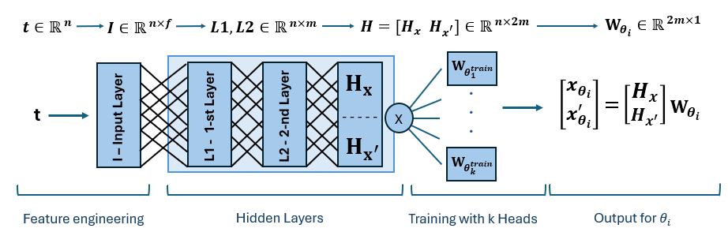
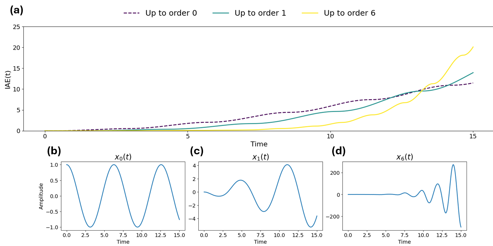
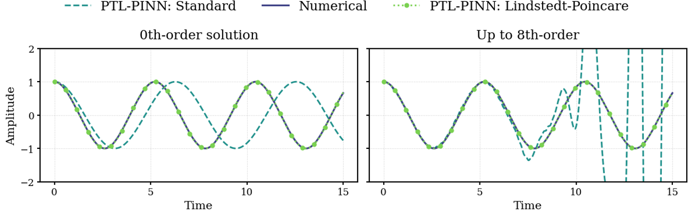
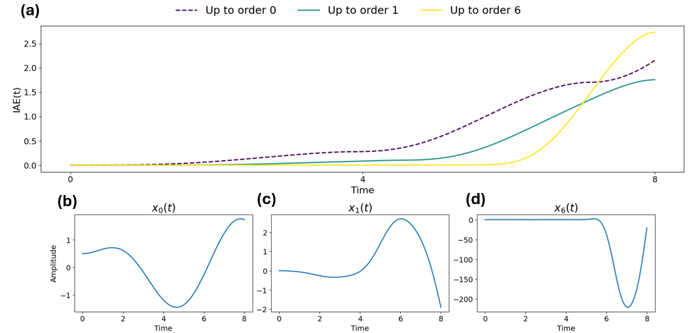
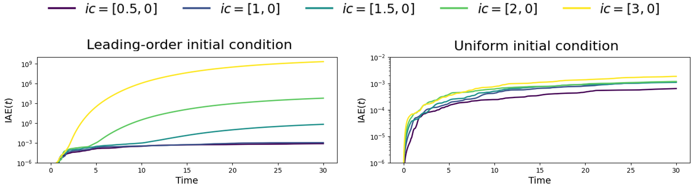
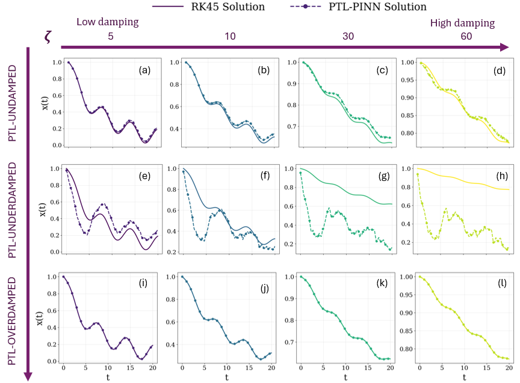
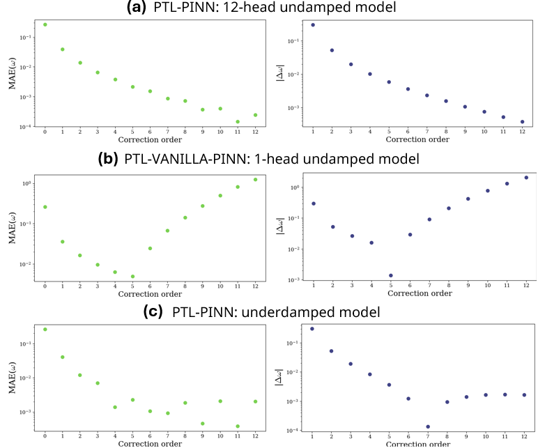
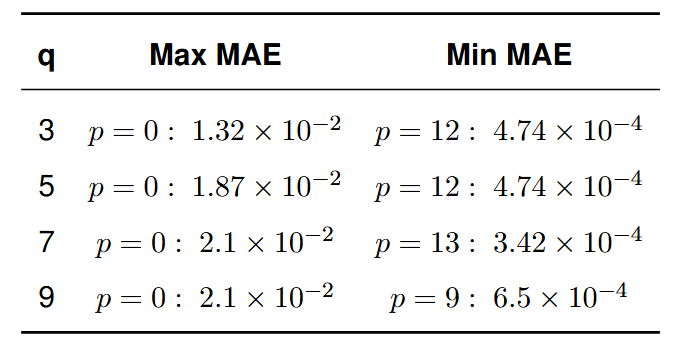
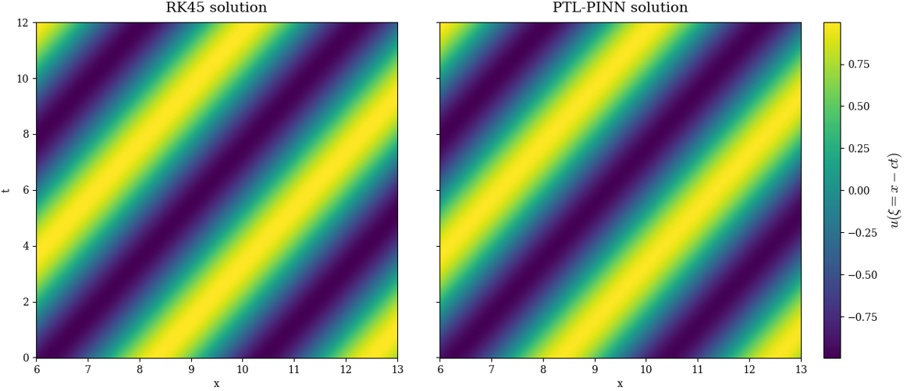
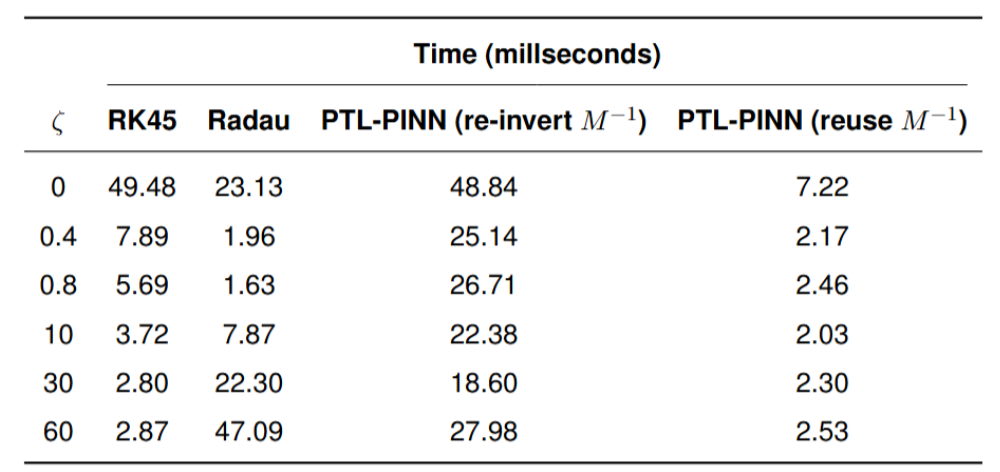

# Perturbation-Guided Transfer Learning with Physics-Informed Neural Networks for Nonlinear Systems: PTL-PINN

**Author:** Duarte Alexandrino  
**Supervisors:** Prof. Pavlos Protopapas, Dr. Ben Moseley  
**MSc in Applied Computational Science and Engineering — Imperial College London**  
**Contact:** d.alexandrino2010@gmail.com

> Master’s thesis project proposing fast and accurate framework to solve weakly nonlinear oscillators by combining perturbation theory with one-shot transfer learning in Multi-Headed PINNs.

---

## 🔎 Overview

Accurately and efficiently solving nonlinear differential equations is crucial for modelling dynamic behavior across science and engineering. Physics-Informed Neural Networks (PINNs) have emerged as a powerful solution. However, these struggle to model nonlinear dynamics, suffering from limited generalization across problems and long training times. To address these limitations, we propose a perturbation-guided transfer learning framework for PINNs (PTL-PINN), which integrates perturbation theory with transfer learning to solve nonlinear oscillators efficiently.

This repository contains the code used to develop the **PTL-PINN** — a **Perturbation-Guided Transfer Learning** framework for **Physics-Informed Neural Networks (PINNs)**. By training foundational PINN models on families of linear ODEs representative of the perturbation system and using one-shot transfer learning, PTL-PINN can compute solutions with the time complexity of matrix-vector multiplication.

---

## Key Contributions

- **Novel Lindstedt-Poincare implementation**: new numerical and scalable implementation of the Lindstedt-Poincare for undamped nonlinear oscillators with polynomial nonlinearity
- **Foundational PINNs models**: Multi-Headed-PINNs trained for **undamped**, **underdamped**,and **overdamped** regimes with Fourier features and sinusoidal activations to mitigate spectral bias.
- **Evaluation of the pratical applicability of perturbation methods**: exploring resonance/near-resonance, convergence of the frequency series, and practical truncation criteria.
- **Evaluation of one-shot transfer learning**: disussion and results for the reuse of latent representations
- **Performance vs. classical solvers (RK45, Radau)** demonstrating comparable accuracy and up to one order of mangitude of faster inference.


---

## Repository Structure

```
PTL-PINNs/
├── ptlpinns/                          
│   ├── __init__.py
│   │
│   ├── odes/   
│   │   ├── __init__.py
│   │   ├── numerical.py        # numerical solver
│   |   ├── forcing.py          # forcing functions      
│   |   ├── equations.py        # ODE definition
│   |
│   ├── models/
│   │   ├── __init__.py
│   |   ├── model.py            # model architecture
│   |   ├── training.py         # training functions
│   |   └── transfer.py         # one-shot transfer learning
│   |   └── train/              # models training
│   |      ├── config/
│   |      |    ├── undamped.yml
│   |      |    ├── underdamped.yml
│   |      |    ├── overdamped.yml
│   |      |    └── ...
│   |      |
│   |      ├── undamped.ipynb
│   |      ├── underdamped.ipynb
│   |      └── overdamped.ipynb
│   |
│   └── perturbation/
│   │   ├── __init__.py
│   │   ├── standard.py         # standard perturbation
│   │   └── LPM.py              # Lindstedt-Poincare method
│   │
│   └── results/
│       ├── __init__.py
│       ├── undamped.ipynb          # standard vs Lindstedt-Poincare
│       ├── lpm_forcing.ipynb       # LPM forcing multiple passes
│       ├── underdamped.ipynb       # underdamped results (and near-resonance)
│       ├── overdamped.ipynb        # overdamped results (and ic blow-up)
│       ├── klein_gordon.ipynb      # klein-gordon travelling wave solution
│       └── time.ipynb              # timings: classic solvers vs. PTL-PINNs         
│
├── figures/                        # figures presented in the README.md
├── pyproject.toml          
└── README.md
```

---

## Multi-Headed-PINN architecture
 
Multi-Headed-PINN uses a shared latent representation to approximate equations of
similar form. It maps time to a latent representation that is used when inferring for a new parameter regime. To mitigate the spectral bias observed when training oscillatory solutions, we use Fourier feature embeddings at the input layer sinusoidal activation functions.



---

## Training equations

We train a different model for the undamped, underdamped and overdamped regimes. The following figures present the linear differential equations used in training for each damping regime:

### Undamped 


### Underdamped


### Overdamped


---

## Results

Here we summarise our finds by presenting the figures shown in the thesis.

### Limitations of perturbation methods

- Standard perturbation method fails to solve undamped oscillator, due to resonance:



- The Lindstedt-Poincare method (LPM) is able to solve the undamped oscillator



- In the particular low damping and forced case, the underdamped solution diverges, due to near-resonance:



- Initial condition is a fundamental limitation of perturbation method but the uniform approach can improve convergence:




### Importance of pre-training

- Models have difficulties generalizing to damped regimes for which they haven't been trained:



- Lindstedt-Poincare frequency convergence depends on the pretraining:



### Generalization of PTL-PINNs

- PTL-PINNs can solve oscillator with nonlinearities up to any power:



- PTL-PINNs can be used for PDEs (ongoing work...). Here, through a variable change we solve the Klein-Gordon equation:




### Computational time


